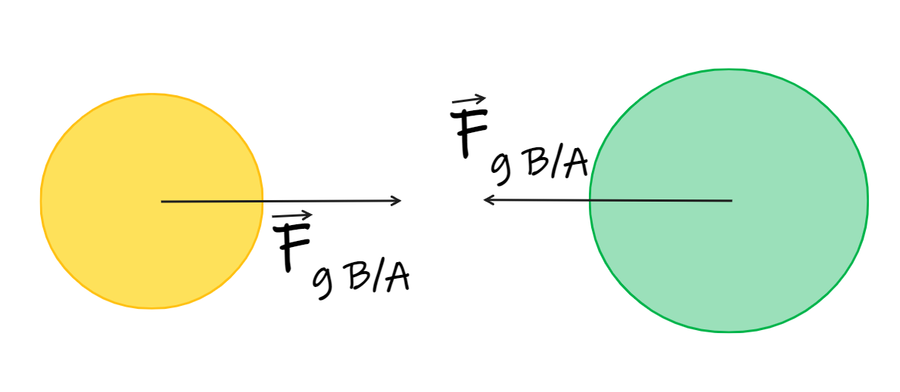
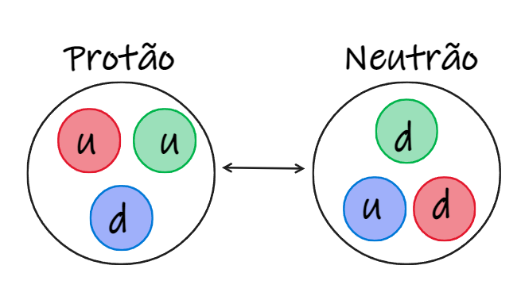
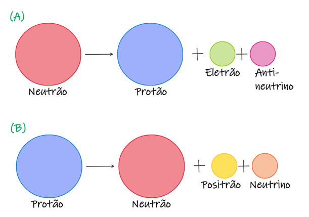
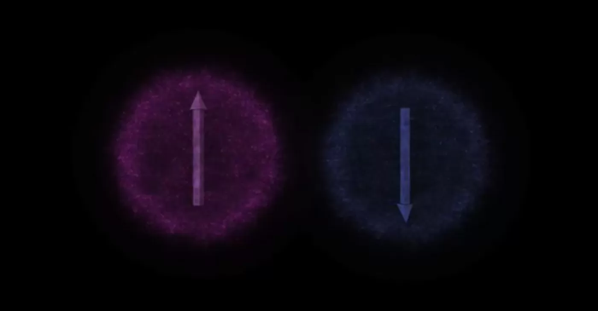

### Força Gravítica

- Força que atua sobre todas as partículas do universo;
- É uma força sempre atrativa;
- Tem alcance infinito;
- As interações gravíticas permitem explicar:
        	- a queda dos corpos à superfície de um planeta;
        	- os movimentos de órbita dos planetas e satélites em torno de corpos maiores;			
- a formação de planetas, estrelas e galáxias;

### Força eletromagnética

- Força que atua sobre partículas carregadas;
- Pode ser uma força tanto atrativa como repulsiva 
(dependendo da carga das partículas);
- Tem alcance infinito;
- As interações eletromagnéticas permitem explicar:
        	- a formação dos átomo;
        	- o funcionamento de aceleradores de partículas;      
- a emissão e absorção de luz;

### Força nuclear forte:
- É a interação com maior intensidade relativa destas 4;
- Atua somente à escala do núcleo de um átomo;					
- Responsável pela existência de ligações entre as 
partículas do núcleo;

### Força nuclear fraca:
- É a interação com menor alcance das 4;
- Atua somente à escala dos constituintes do núcleo;			
- Permite explicar o decaimento radioativo das partículas;

Nestas 4 interações apenas é alterado o estado do sistema de corpos ou partículas, não sendo alteradas as características das partículas constituintes do sistema. Por exemplo, a atração gravítica entre dois corpos altera a posição relativa dos dois corpos mas nunca a massa desses mesmos corpos.

O entrelaçamento quântico nada mais é do que outra interação. Mas neste caso, as partículas interagem de maneira tal, que as propriedades específicas de uma das partículas dependem das propriedades da outra.
O entrelaçamento quântico acontece quando duas partículas se encontram ligadas mesmo que estas se encontrem a anos-luz uma da outra.
O spin é uma propriedade da partícula que ajuda a compreender este fenómeno, este está associado ao campo magnético das partículas e pode ser descrito usando apenas dois valores representados por uma seta para cima ou para baixo.
Ao estudarmos dois eletrões, se estes interagirem passamos a tratá-los como um sistema e nesse sistema existem alguns estados possíveis, o 1º eletrão pode ter spin para cima ou para baixo e o mesmo pode acontecer com o 2º eletrão. Mas pelo princípio de exclusão de Pauli que afirma que dois eletrões não podem ter o mesmo número quântico e dado que o spin se trata de um número quântico, concluímos que se o 1º eletrão tiver o spin voltado para cima o 2º eletrão terá obrigatoriamente de ter o spin voltado para baixo e vice-versa.

Portanto se conhecermos uma propriedade de uma das partículas conhecemos também uma propriedade da outra partícula entrelaçada, ou seja, para conhecermos um sistema por completo só necessitamos de conhecer as características de metade dele.

Isto pode ser demonstrado através de um exemplo prático com um sistema de duas partículas entrelaçadas, onde duas moedas representam  as duas partículas e as faces das mesmas a propriedade a ser estudada: ao lançar a primeira moeda,se calhar coroa, já sabemos através entrelaçamento quântico que a propriedade de uma partícula não se pode repetir noutra, sendo assim mesmo sem lançar a segunda moeda já sabemos a face que irá calhar, neste caso será a cara.

 	

Contudo este fenómeno levantou algumas dúvidas, a informação acerca do sistema é transmitida a uma velocidade instantânea (superior à velocidade da luz) tendo sido esse o problema que Einstein viu no fenómeno do entrelaçamento uma vez que não deveria ser possível ultrapassar a velocidade da luz.
Em 2013, uma equipa de físicos chineses com o objetivo de medir esta velocidade entrelaçaram vários pares de fotões e colocaram metade de cada par em unidades de contenção para poderem observar as partículas. Estas unidades estavam a cerca de 15,3 km uma da outra. Durante 12 horas, a equipa de físicos observou ambas as partículas de cada par ao inserir uma dada informação numa delas para tentar medir a velocidade com que a outra partícula recebia a informação. Após todo este tempo e com várias medições, chegaram à conclusão de que a velocidade era aproximadamente 3,0x10^12 m/s
O entrelaçamento quântico mostra-se útil pois permite o conhecimento das propriedades quânticas de duas partículas entrelaçadas, servindo de base a tecnologias como o computador quântico, uma vez que aumenta a capacidade e rapidez no processamento de informação.