## O que é a Astrofísica?

A astrofísica é o ramo da física que estuda o universo e os fenómenos à escala astronómica. Naturalmente, entre os temas estudados estão o Sol, outras estrelas e galáxias. No entanto, os astrofísicos também estudam planetas extrasolares, o meio interestelar e a radiação cósmica de fundo.  

O estudo da astrofísica parte do estudo das emissões de cada um destes corpos. Na verdade, todos os corpos possuem a sua própria emissão que pode ser interpretada como a sua energia intrínseca que produz um espectro, isto significa que também nós humanos temos o nosso próprio espectro de emissão!

Astrofísicos tentam determinar as propriedades de matéria negra, buracos negros e outros corpos celestiais, assim como a origem e o destino do universo. Astrofísicos teóricos também se questionam em como o Sistema Solar se formou e evoluiu, envolvendo o estudo da dinâmica estelar e da evolução.

## Um corpo negro e a problemática do seu espectro…

Toda a matéria emite radiação eletromagnética quando tem uma temperatura acima do zero absoluto. Por outro lado, esta também absorve essa radiação até certo ponto. Um objeto que absorve toda a radiação que lhe atinge, de qualquer comprimento de onda é chamado de corpo negro.

Apesar das estrelas produzirem um espectro contínuo que se estende desde ondas de rádio até raios gama, elas não emitem a mesma quantidade de energia para todos os comprimentos de onda.

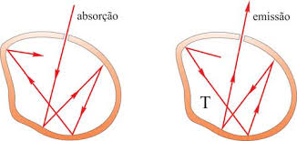

Até ao séc. 19, cientistas não conseguiam explicar porque é que o espetro observado da radiação de um corpo negro, que já tinha sido medida com precisão, divergia de forma significativa a frequências mais altas do que as teorias existentes previam.

## A solução!

Em 1900, Max Planck deduziu uma fórmula para observar o espetro observado por um corpo negro, que envolve apenas a frequência da radiação e da temperatura do corpo:

 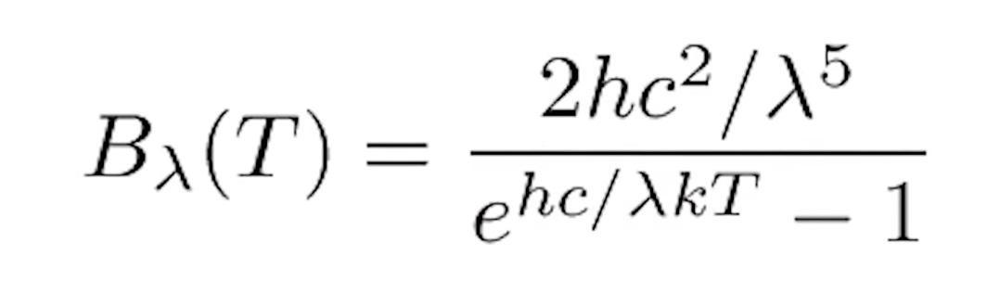

 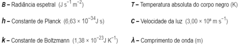

 À primeira vista, estrelas podem ser pensadas da mesma forma que corpos negros, no entanto o espetro observado por estas não corresponde a uma função de Planck exata. Nesta imagem ao lado podemos observar  uma representação gráfica das emissões de uma estrela típica. E como podemos observar, as linhas do gráfico são muito diferentes de uma função de Planck típica, e parece que faltam algumas "linhas". 

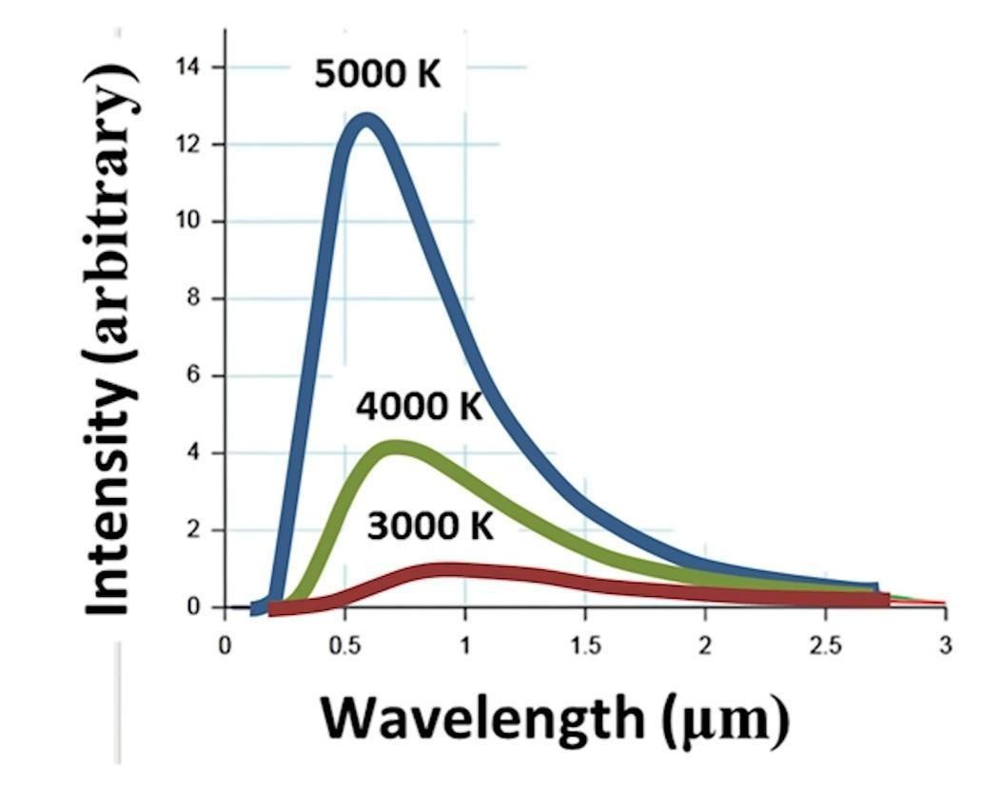

Isto confundiu muitos cientistas até ao fim do século 19, após os cientistas Gustav Kirchhoff e Robert Bunsen terem  introduzido os primeiros estudos relativamente ao tema da espetroscopia. 

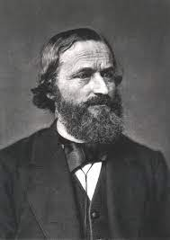

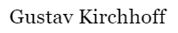

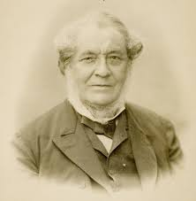

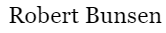

## Espectroscopia

A espetroscopia é uma técnica experimental que se baseia na utilização da luz para estudar a composição, a estrutura e as propriedades da matéria. Assim, a espetroscopia baseia-se no estudo da interação entre matéria e radiação eletromagnética.

Podemos identificar 2 tipos de espetros: espetros de emissão e espetros de absorção. Estes dois espetros são únicos e exclusivos para cada elemento químico, sendo estes, assim ideais para a identificação destes numa substância.

#### Espetro de Emissão 

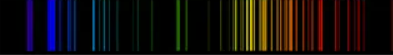

Aqui em cima podemos observar o espetro de emissão do elemento Hélio. As riscas apresentadas são as zonas do espectro eltromagnético, na zona do visível, que este elemento emite.

#### Espetro de Absorção

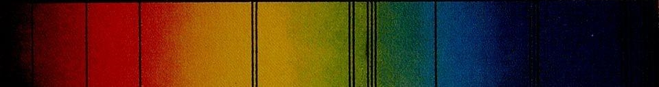

Nesta imagem podemos observar o espetro de absorção solar. O sol emite luz de toda a zona do visível. As riscas negras observadas correspondem, assim, à luz solar que é absorvida pelos gases existentes na atmosfera.

A espetroscopia é fundamental não só para o estudo do conteúdo, das massas e de outras características físicas de um corpo celeste, mas também para o estudo da velocidade e posição destes. Estas últimas duas características devem-se aos fenómenos de redshift e blueshift, provocados pela diminuição dos comprimentos de onda da sua radiação emitida, devido ao Efeito Doppler causado pelo seu movimento. Este fenómeno será já a seguir explicado com maior detalhe.
 
## Como sabemos que o universo se está a expandir? Por causa das evidências fornecidas pelo redshift!

Redshift, é o deslocamento do espetro de um objeto astronómico para comprimentos de onda mais longos (vermelho). É atribuído ao Efeito Doppler, uma mudança no comprimento de onda que resulta quando uma determinada fonte de ondas e um observador estão em movimento um em relação ao outro.

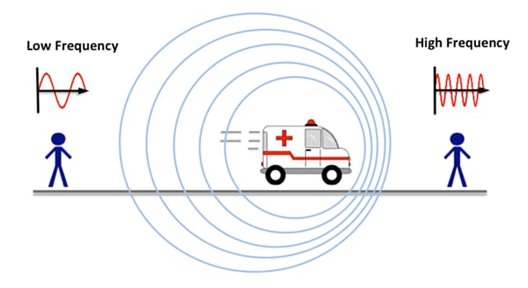

Hubble relatou em 1929 que as galáxias distantes estavam a afastar-se do sistema da Via Láctea, no qual a Terra está localizada, e que seus desvios para o vermelho aumentam proporcionalmente com o aumento da distância.

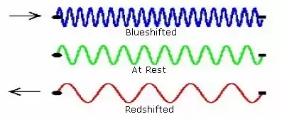

Essa generalização tornou-se a base para o que é chamado de Lei de Hubble, que relaciona a velocidade de recessão de uma galáxia com a sua distância da Terra. Ou seja, quanto maior o desvio para o vermelho manifestado pela luz que provém de tal objeto, maior a distância do objeto e maior sua velocidade de afastamento. Essa lei de redshifts foi confirmada por pesquisas subsequentes, e hoje serve de base para teorias cosmológicas relativistas modernas que postulam que o universo está em expansão.

## Telescópio Hubble

O Telescópio Espacial Hubble foi nomeado em homenagem ao astrónomo Edwin Powell Hubble (1889-1953), que fez algumas das  descobertas mais importantes da astronomia moderna.

Hubble foi lançado a bordo do vaivém espacial Discovery (STS-31) em 24 de abril de 1990. Foi implantado em órbita no dia seguinte, 25 de abril de 1990.

Hubble orbita a Terra a uma altitude de cerca de 547 quilómetros, inclinada a 28,5 graus até o equador, e viaja a uma velocidade de cerca de 27300 quilómetros por hora.

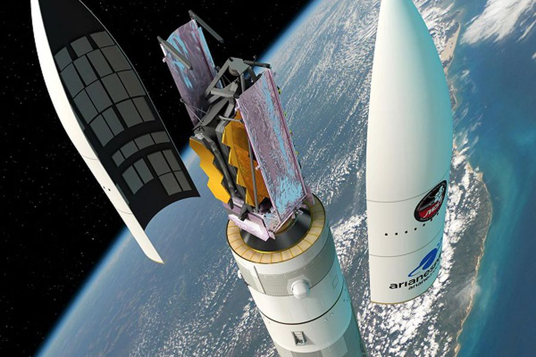

Hubble é um telescópio Cassegrain — um tipo de telescópio refletor. A luz entra no telescópio e atinge o grande espelho primário. A luz é então refletida do espelho primário para o espelho secundário, que então foca a luz de volta através de um buraco no espelho primário até um ponto atrás desse espelho, onde se encontram os instrumentos científicos.

O Espectrógrafo de Imagens do Telescópio Espacial (STIS), um instrumento instalado no Hubble em fevereiro de 1997, é o principal "caçador de buracos negros" do telescópio espacial.

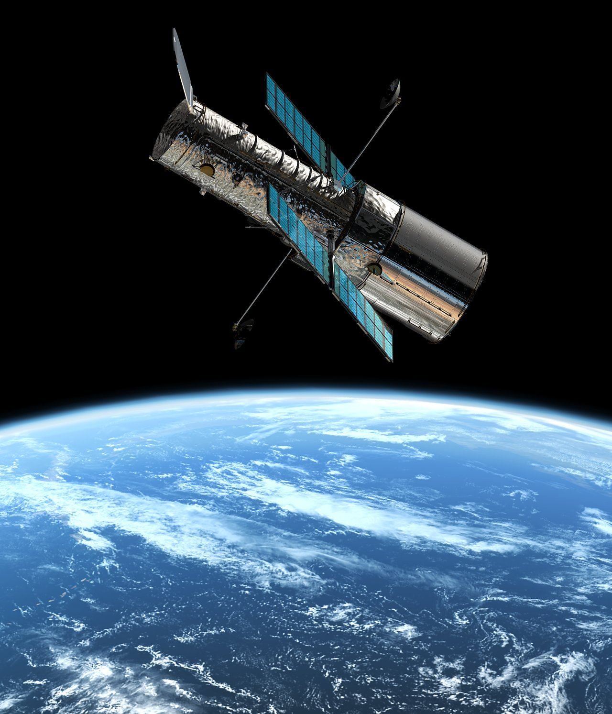

O STIS pode receber um espectro de muitos lugares ao mesmo tempo através do centro de uma galáxia, o que diz aos cientistas quão rápido as estrelas e o gás estão a girar naquele local

Com essa informação, a massa central que as estrelas estão a orbitar pode ser calculada. Quanto mais rápido as estrelas vão, mais massivo o objeto central deve ser.

O STIS encontrou, por exemplo, a assinatura de um buraco negro supermassivo no centro da galáxia M84.

Os espectros mostraram que o disco em torno do buraco negro está a girar a uma velocidade de cerca de 400 quilómetros por segundo.

Se a Terra se movesse tão rápido quanto o disco em redor do buraco negro de M84, o nosso ano teria apenas 27 dias de duração!

Entre as suas muitas descobertas, Hubble revelou que a idade do universo é de cerca de 13,8 mil milhões de anos, muito mais exata do que a antiga faixa dos 10 a 20 mil milhões de anos. Hubble desempenhou um papel fundamental na descoberta da energia negra, uma força misteriosa que faz acelerar a expansão do universo.

## Fotografias tiradas pelo Hubble:

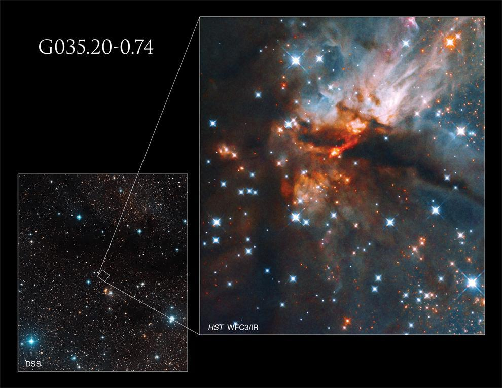

Esta nebulosa forma estrelas na constelação de Aquila, G035.20-0.74, é conhecida por produzir um tipo particular de estrela massiva conhecida como estrela do tipo B. Essas estrelas são estrelas quentes, jovens, azuis e até cinco vezes mais quentes que o nosso Sol.

Para celebrar o trigéssimo aniversário do Telescópio Espacial Hubble, foi publicada esta imagem que mostra a região massiva de formação de estrelas. Esta região tem o nome de Recife Cósmico

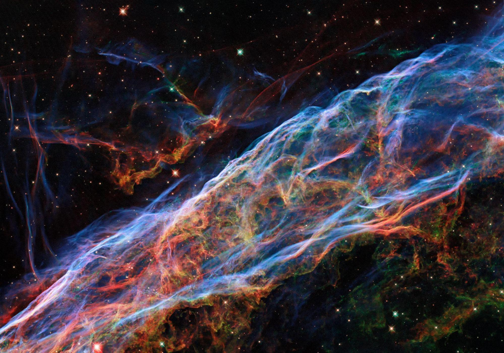

Esta imagem tirada pelo telescópio Espacial Hubble da NASA/ESA revisita a Veil nebula, que foi apresentada numa versão anterior do Hubble. Nesta imagem. novas técnicas de processamento foram aplicadas, trazendo detalhes mais delicados.

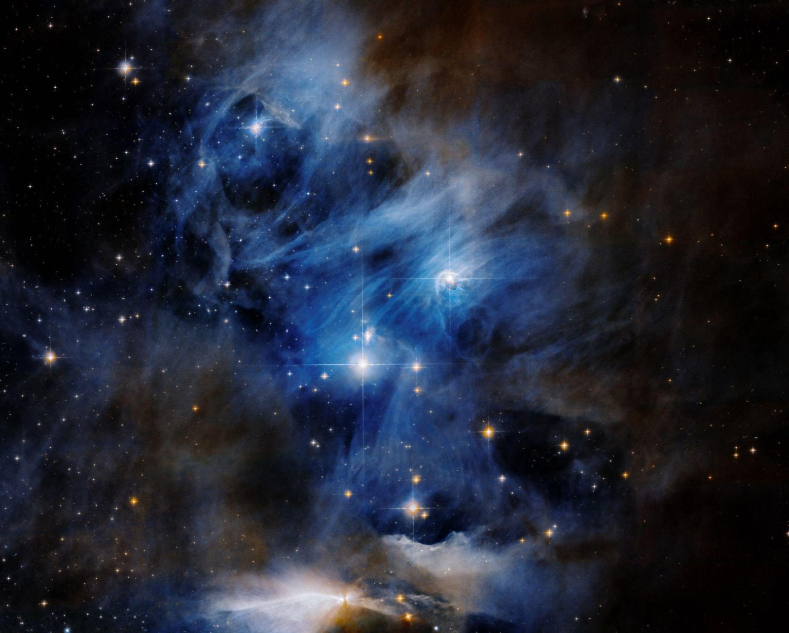

Esta imagem do Telescópio Espacial Hubble da Nasa captura um dos três segmentos qyue compõem uma região de formação estelar com 65 anos luz de largura chamada de Chamaeleon Cloud complex.

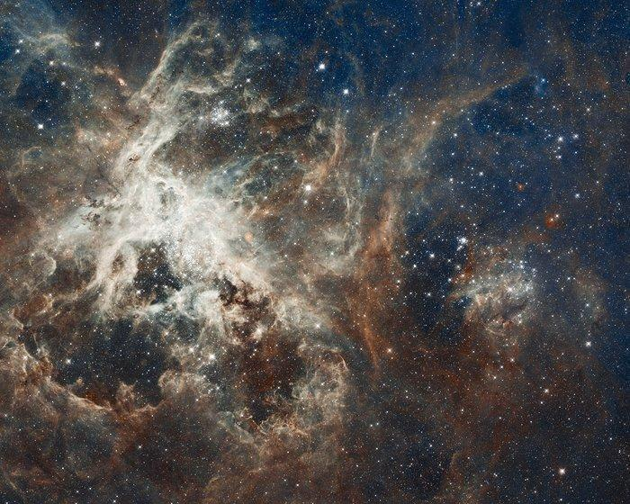

30 Doradus é a região de formação de estrelas mais brilhantes da nossa vizinhança galática e abriga as estrelas mais massiva já vistas.

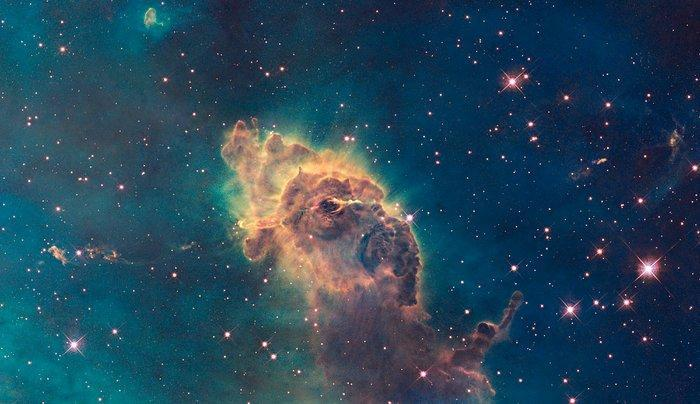

Composto de gás e poeira, o pilar retratado reside num berçário estelar chamado Carina Nebula's. Tirada na luz visível, a imagem mostra a ponta do pilar de três anos-luz de comprimento, banhado pelo brilho da luz de estrelas quentes e massivas.

## Buracos Negros

Um buraco negro é um objeto astronómico com uma atração gravitacional tão forte que nada, nem mesmo a luz, pode escapar dele. A “superfície” de um buraco negro, chamada de horizonte de eventos, define o limite onde a velocidade necessária para escapar excede a velocidade da luz, que é o limite de velocidade do cosmos.

O primeiro debate acerca de buracos negros ocorreu em 1783, por um homem de Cambridge, John Mitchell. A sua argumentação era a seguinte: se dispararmos uma partícula, como uma bola de canhão, verticalmente para cima, esta será abrandada pela gravidade.

Por fim, a partícula deixa de avançar no sentido ascendente e cairá.

Contudo, se a velocidade ascendente inicial for maior do que um determinado valor crítico, chamado velocidade de escape, a gravidade nunca será suficientemente forte para parar a partícula, e esta escapar-se-á.

A velocidade de escape encontra-se ligeiramente acima dos 11 quilómetros por segundo no caso da Terra e cerca de 617 quilómetros por segundo no do Sol.

Um buraco negro de massa estelar,  forma-se quando uma estrela com mais de 20 massas solares esgota o combustível nuclear do núcleo e colapsa sob o seu próprio peso. O colapso desencadeia uma explosão supernova que explode as camadas externas da estrela. Mas se o núcleo esmagado contiver cerca de três vezes a massa do Sol, nenhuma força conhecida pode impedir o seu colapso num buraco negro. A origem dos buracos negros supermassivos é mal compreendida, mas sabemos que eles existem desde os primeiros dias da vida de uma galáxia.

Em 2019, astrónomos usaram o Event Horizon Telescope (EHT) e capturaram a primeira imagem de um buraco negro.

Outra importante descoberta relacionada com os buracos negros ocorreu em 2015, quando os cientistas detetaram pela primeira vez ondas gravitacionais, ou seja, ondulações no tecido do espaço-tempo previstas um século antes pela teoria geral da relatividade de Albert Einstein.

O LIGO detetou as ondas de um evento chamado GW150914, onde dois buracos negros em órbita espiralaram um no outro e fundiram-se há cerca de mil milhões de anos. Desde então, o LIGO e outras instalações observaram inúmeras fusões de buracos negros através das ondas gravitacionais que produzem.

LIGO significa “Laser Interferometer Gravitational-wave Observatory”. É o maior observatório de ondas gravitacionais do mundo e uma maravilha de engenharia de precisão. Composto por dois enormes interferómetros a laser localizados a 3000 quilómetros de distância, o LIGO explora as propriedades físicas da luz e do próprio espaço para detetar e entender as origens das ondas gravitacionais.

A Teoria da Relatividade Geral de Einstein de 1915 previu que a atração gravitacional dos buracos negros é tão grande que os buracos negros deformam o tecido do espaço. A sua teoria postulava que essa atração gravitacional extremamente massiva era tão grande que torcia os campos magnéticos e dobrava as ondas de luz perto dos buracos negros.

No século passado, quando os astrofísicos começaram a especular sobre o comportamento do campo magnético perto de um buraco negro, eles não conseguiam imaginar que hoje em dia poderiam existir técnicas para observar isso diretamente e ver a Teoria da Relatividade Geral em ação.

O mistério à volta dos buracos negros ficou mais claro graças aos telescópios modernos. Foi assim que o autor do relatório da Nature, Dan Wilkins, astrofísico da Universidade de Stanford, e Blandford, finalmente conseguiu provar a teoria de Einstein, mais de 100 anos depois.

Utilizando um telescópio especial de raios-X superpotente observou-se e estudou-se um buraco negro a 800 milhões de anos-luz de distância, no centro de uma galáxia. Foi assim que se descobriu que luz em forma de raios-X estava a ser ejetada pela parte traseira do buraco negro.

Deveria ser impossível ver luz do outro lado de um buraco negro, mas graças a Wilkins e a sua equipa foi provado o contrário.

Quando analisaram os dados coletados, descobriram que o buraco negro estava a disparar raios-X diretamente para a Terra, que é perfeitamente normal. O que não era normal era o facto da equipa ver raios-X disparados na direção exatamente oposta.

Isto prova que a teoria de Einstein está correta. Os buracos negros distorcem tanto o tecido espacial que os seus campos magnéticos são capazes de espelhar as ondas de luz disparadas do lado contrário.

Primeira imagem de um buraco negro:

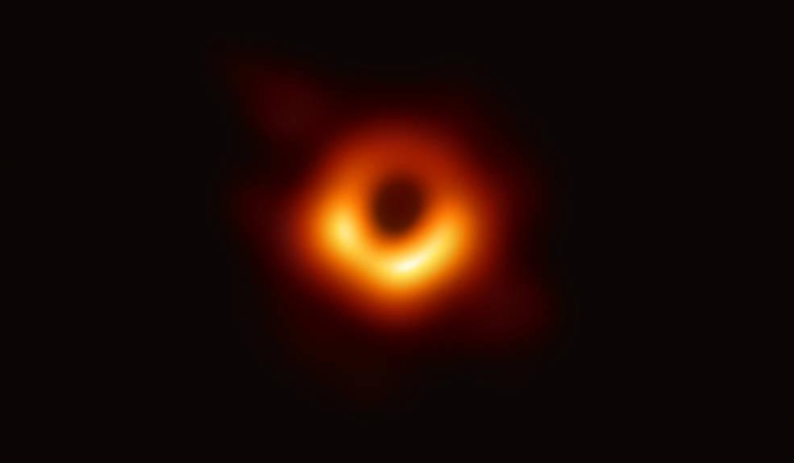