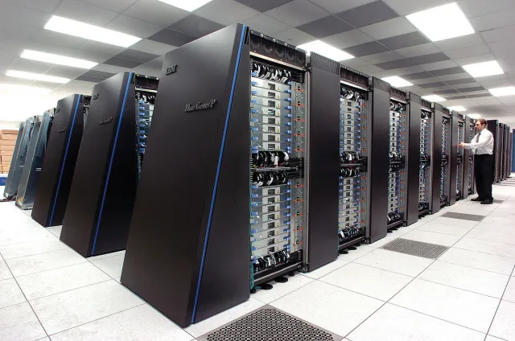

## História do computador quântico

Na década de 50 apareceram as primeiras especulações e teorias sobre a aplicação das leis da física quântica na construção de computadores.  

Em 1981, o físico Richard Feyman, ganhou o Prémio Nobel de Física de 1965, enquanto estudava física quântica, ele criou a primeira proposta para o uso das propriedades quânticas para desenvolver programas informáticos, acabando por criar a primeira ideia para um computador quântico.  

Em 1985, o físico israelita David Deustch, da Universidade Oxford, descreveu matematicamente o primeiro computador quântico universal (máquina de Turing Quântica). A ciência de computação tradicional é baseada na teoria da Máquina de Turing, que é o computador eletrónico universal, a computação quântica também poderia ter uma engenharia semelhante ao da computação tradicional.  

Em 1994, o professor de matemática aplicada Peter Shor, criou o primeiro programa  quântico, o Algoritmo de Shor, que permitiria a um computador quântico fatorar grandes números em segundos.  

Em 1996, o matemático Lov Grover, da Bell Labs, também desenvolveu o seu programa quântico. Chamou-o de Speedup, e este programa foi o primeiro algoritmo programado para pesquisa de bases de dados armazenados em bits quânticos ou qubits.  

Em 1999, foi desenvolvido no MIT os primeiros protótipos de um computador quântico real.  

Em 2007, A empresa Canadense D-Wave afirmou ter construído o primeiro processador quântico da história da humanidade, batizado de Orion. O Orion é um processador híbrido de 16 qubits que também poderia processar bits tradicionais. Embora tenha feito algumas demonstrações, a comunidade científica recebeu a notícia com muita desconfiança, pois D-Wave não tinha publicado nenhuma revista ou jornal detalhado sobre o Orion. Os especialistas em Física e em Ciência da Computação afirmaram que só seria possível a construção de uma máquina assim por volta do ano 2030.     

## O que é um computador Quântico?

Um Computador Quântico é uma máquina que executa o seu processamento baseado nas propriedades quânticas da matéria, criando um novo e revolucionário modo de armazenar e tratar dados. Algumas das propriedades só existem a nível microscópio.
Um computador clássico tem uma memória feita de bits. Cada bit guarda um "1" ou um "0" de informação. Um computador quântico mantém um conjunto de qubits. Um qubit pode conter tanto um "1" como um "0" ao mesmo tempo.
            Para um computador quântico funcionar, ele depende de um efeito chamado Entrelaçamento Quântico, este é o fenómeno que permite que dois ou mais objetos estejam ligados entre si de tal forma que ao observar-se o movimento de uma particula consegue-se prever o movimento da outra, pois estas estão conectadas, mesmo que estejam separadas por grandes distâncias.

## Para que serve um computador Quântico?

A empresa D-Wave Systems, uma das mais conhecidas empresas na criação e desenvolvimento de computadores quânticos, construiu o primeiro computador quântico que é capaz de ser obtido comercialmente, o D-Wave One, que tem um custo de cerca de 10 milhões de dólares americanos.

Devido ao seu elevado custo, um computador quântico não serve para uso público, mas sim para a divisão de grandes quantidades de dados, por ter uma grande capacidade de processar dados simultaneamente.

Assim, os computadores quânticos são usados para criar chaves criptográficas mais fortes 
para pesquisas científicas, simulações biológicas, astronómicas, entre outras, e têm também uma grande utilidade no desenvolvimento de medicamentos.

Os computadores quânticos também irão permitir a transmissão de internet pelo vácuo de uma forma mais rápida e sem haver perda de pacotes de dados.

## Quais as limitações de um computador quântico?

Os computadores quânticos só funcionam em condições muito específicas, os qubits só assumem as características de entrelaçamento em temperaturas próximas ao zero absoluto (-273,15 ºC), exigindo sistemas sofisticados de refrigeração. Além disso, o núcleo precisa de ser blindado com campos magnéticos, que podem interferir nos cálculos e prejudicar o funcionamento dos computadores, estes cuidados a ter para o computador funcionar fazem o preço de produção e de manutenção aumentar fazendo com que quem tem estes computadores tenha de ter um grande poder económico. Para além dos custos de produção e de manutenção o seu tamanho também se torna uma limitação, tendo em conta que estes possuem grandes dimenções.

## Tecnologia quântica em Portugal

O projeto realizado pela  Warpcom, IP Telecom e ID Quantique criou a primeira ligação de longa distância para a distribuição de chaves quânticas, esta consiste no processo de criação de uma chave secreta utilizada para criptografar e descriptografar mensagens, com mais de 20 quilómetros, esta é a primeira rede de longa distância do género criada em território português.
Deste modo é possível serem realizadas comunicações ultra secretas com esta tecnologia.
Na prática, são introduzidos na rede de fibra ótica fotões polarizados cuja orientação corresponde a conjuntos binários (zeros e uns) que através da chave são encriptados e prosteriormente descriptados. 

 ## Opinião sobre computadores quânticos e tecnologia quântica

A tecnologia quântica é um tema bastante interessante e representa o futuro tecnológico, podendo vir a substituir outras tecnologias como a computação atual pela computação quântica. No entanto, neste momento é algo que ainda está numa fase inicial e o seu desenvovimento e aquisição apresentam custos bastante elevados para a grande maioria das pessoas e empresas, futuramente o preço poderá vir a baixar quando esta for mais banalizada.
Esta tecnologia poderá levar a progressos espaciais devido à capacidade de transmissão de informação pelo vácuo sem perda de pacotes de dados, além disso esta tecnologia apresenta uma grande capacidade de armazenamento e realização de cálculos, tornando-se bastante inovadora.
