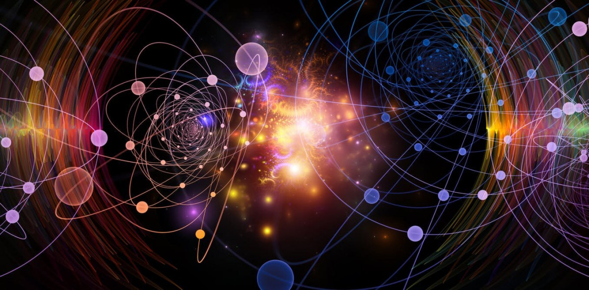
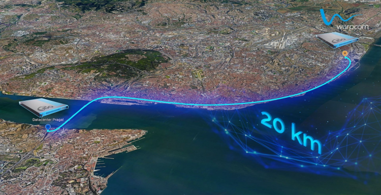

## História do computador quântico

Na década de 50 começaram a haver as primeiras especulações e teorias sobre a aplicação das leis da física quântica na construção de computadores.
Em 1965, o físico Richard Feynman, ganhou o Prémio Nobel da física, enquanto estudava física quântica, ele criou a primeira proposta para o uso das propriedades quânticas para desenvolver programas informáticos, acabando por criar a primeira ideia para um computador quântico.quântico

Em 1985, o físico Israelense David Deutsch, da Universidade Oxford, descreveu matematicamente o primeiro computador quântico universal (máquina de Turing Quântica). A ciência de computação tradicional é baseada na teoria da Máquina de Turing, que é o computador eletrônico universal, a computação quântica também poderia ter uma engenharia semelhante.
Em 1994, o professor de matemática aplicada Peter Shor, enquanto estava a trabalhar no AT & T, criou o primeiro programa puramente quântico. Esse programa, o Algoritmo de Shor, permitiria a um computador quântico fatorar grandes números em segundos.

Em 1996, o matemático Lov Grover, da Bell Labs, também desenvolveu o seu programa quântico. Batizou-o de Speedup, este programa foi o primeiro algoritmo para pesquisa de bases de dados armazenadas em bits quânticos ou qubits.
Em 1999, foi desenvolvido no MIT os primeiros protótipos de um computador quântico real.

Em 2007, A empresa Canadense D-Wave afirmou ter construído o primeiro processador quântico da história da humanidade, batizado de Orion. O Orion é um processador híbrido de 16 qubits que também poderia processar bits tradicionais. Embora tenha feito algumas demonstrações, a comunidade científica recebeu a notícia com muita desconfiança, pois D-Wave não tinha publicado nenhuma revista ou jornal detalhado sobre o Orion. Os especialistas em física e em ciência da computação afirmam que só seria possível a construção de uma máquina assim por volta do ano 2030.

## O que é um computador Quântico?

Um Computador quântico é uma máquina que executa o seu processamento baseado nas propriedades quânticas da matéria, criando um novo e revolucionário modo de armazenar e tratar dados. Algumas das propriedades só existem a nível microscópico.

Um computador clássico tem uma memória feita de bits. Cada bit guarda um "1" ou um "0" de informação. Um computador quântico mantém um conjunto de qubits. Um qubit pode conter tanto um "1" como um "0" ao mesmo tempo. O computador quântico funciona pela manipulação destes qubits.

Para um computador quântico funcionar, este depende de um efeito chamado Entrelaçamento quântico, este fenómeno permite que dois ou mais objetos estejam ligados de tal forma que um não possa ser corretamente descrito sem que a sua contra-parte seja mencionada,  isso leva a correlações muito fortes entre as propriedades físicas observáveis das diversas partículas subatômicas

## Para que serve um computador Quântico?

Um computador quântico é uma tecnologia muito cara, por exemplo, a empresa D-Wave Systems, talvez a mais conhecida empresa na criação e desenvolvimento de computadores quânticos, construiu o primeiro computador quântico que é capaz de ser obtido comercialmente, o D-Wave One, que tem um custo de cerca de 10 milhões de dólares americanos.

Devido ao seu elevado custo, um computador quântico não serve para uso público, mas sim para a divisão de vastas quantidades de dados, por ter uma grande capacidade de processar dados simultaneamente.

Assim, os computadores quânticos são usados para criar chaves criptográficas mais fortes 
para pesquisas científicas, simulações biológicas, astronómicas, entre outras, e têm também uma grande utilidade no desenvolvimento de medicamentos.

Os computadores quânticos também irão permitir a transmissão de internet pelo vácuo de uma forma mais rápida e sem haver “packet loss”.

## Quais as limitações de um computador quântico?

Os computadores quânticos só funcionam em condições muito específicas, os qubits só assumem as características de entrelaçamento em temperaturas próximas ao zero absoluto (-273,15º C), exigindo sistemas sofisticados de refrigeração. Além disso, o núcleo precisa de estar coberto por campos magnéticos ou ondas eletromagnéticas, que podem interferir nos cálculos e prejudicar o funcionamento dos computadores, tornando os computadores muito mais caros que os computadores convencionais. Para além dos custos de produção e de manutenção destes computadores o seu tamanho também se torna uma limitação, sendo que a grande maioria destes computadores apresentam grandes dimensões.

## Tecnologia quântica em Portugal

Projeto realizado pela  Warp Com, IP Telecom e ID Quantique criou a primeira ligação de longa distância para a distribuição de chaves quânticas, com mais de 20 quilómetros, esta é a primeira rede de longa distância do género criada em território português.
Deste modo é possível realizarem-se comunicações ultra secretas com tecnologia denominada de distribuição de chaves quânticas.
Na prática, são introduzidos na rede, de fibra ótica, fotões polarizados cuja orientação corresponde a conjuntos binários (zeros e uns) que correspondem a uma chave de encriptação. Já do lado do emissor ocorre o processo contrário onde é usado um filtro para perceber qual a chave de encriptação a partir da polarização de cada fotão

 ## Opinião sobre computadores quânticos e tecnologia quântica

 Apesar de achar que a tecnologia quântica, e consequentemente os computadores quânticos serem algo bastante interessante, é algo que neste momento e provavelmente assim continuará a ser no futuro, está apenas designado para empresas muito ricas, devido ao seu elevado custo, e isto é algo que não mostra sinais de mudar pelo menos num futuro próximo, devido à constante evolução da tecnologia, e consequente aumento do seu preço. Como já referi, um computador quântico custa cerca de 10 milhões de dólares brasileiros, um preço exorbitante para a grande maioria das pessoas e até empresas, por isso, mesmo com todo o potencial desta tecnologia e de o quão interessante seja a transmissão de internet pelo vácuo sem haver perda de pacotes por exemplo, isto é algo que apenas estará disponível a uma parte muito pequena da população.

