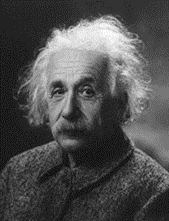
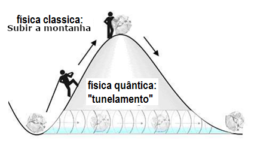
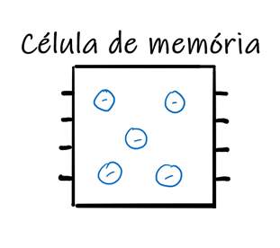
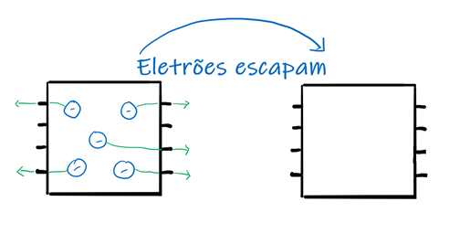
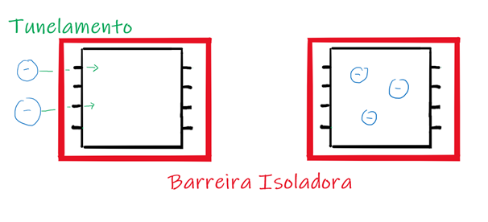

## Entrelaçamento Quântico

O Universo está repleto de fenómenos estranhos e isso não poderia ser mais evidente quando o objeto de estudo são partículas a escalas moleculares, atómicas e subatómicas assim como as suas interações. Um dos acontecimentos mais bizarros verificados pela física quântica é o entrelaçamento quântico cujas implicações conseguiram até mesmo “assustar” Albert Einstein.

“Spooky action at a distance” – Albert Einstein.  
Mas antes de mergulhar sobre este tema tão enigmático vamos dar um passo atrás:
Durante a passagem pelo ensino secundário estudámos vários tipos de interações entre as partículas: Força gravítica, Força eletromagnética, Força nuclear forte e Força nuclear fraca, para saber mais clique [ aqui](/forcas).

## Tunelamento Quântico

O tunelamento quântico é um fenómeno no qual uma partícula consegue ultrapassar barreiras mesmo que a energia cinética da partícula seja menor do que a energia potencial da barreira.
Uma onda é capaz de atravessar obstáculos dependendo da sua frequência, mas uma partícula como é o caso de um eletrão só deveria conseguir fazer isso se tivesse uma energia bastante elevada.
Existe contudo uma probabilidade de um eletrão se materializar do outro lado de uma barreira e esta probabilidade aumenta à medida que a espessura da barreira diminui.

### Isto tudo pode ser explicado usando um exemplo prático:
Imaginemos que um carro quer chegar a um certo destino, mas que para lá chegar tem de passar por uma rampa, durante a subida a sua energia cinética transforma-se em energia potencial, até que quando chegar ao topo da rampa esta estará no seu valor máximo.
A física clássica só consegue garantir que o carro chegue ao topo da rampa se a sua energia mecânica inicial for maior ou igual do que o valor máximo de energia potencial atingido no topo da rampa. Já na física quântica existe uma possibilidade do carro aparecer do outro lado da rampa, não importando o valor da sua energia cinética inicial.
Sendo assim, pelo tunelamento quântico, a partícula (neste caso o carro) atravessa por dentro da rampa (a barreira potencial) em vez de fazer o percurso todo, como se teletransportasse.

### Agora, onde é que o tunelamento quântico se mostra útil?
Um dos exemplos mais comuns da utilização do tunelamento quântico está relacionado com o armazenamento de memória.
Os cartões SSD (chips de memória), usados nos computadores, utilizam células de memória de tamanho extremamente pequeno em que diferentes cargas são utilizadas para armazenar informação. 
O problema que se coloca é que, não existindo isolamento elétrico, os eletrões podem escapar da célula de memória, perdendo-se assim a informação.

A solução encontrada é criar uma barreira feita de material isolador não permitindo assim a saída de informação através dos eletrões. Segundo a física clássica, não seria possível gravar nova informação na célula de memória, uma vez que estaria isolada. Mas é aí que entra a física quântica. Através do efeito de túnel é possível transportar os eletrões para a célula evitando a barreira (isolador) sendo este o mecanismo usado pelos cartões SSD.

  

Contudo o tunelamento quântico levanta o mesmo problema que o fenómeno do entrelaçamento.
Quando se estuda o tunelamento quântico, é importante perceber a que velocidade se dá o transporte da partícula que atravessa a barreira segundo o efeito de túnel. Segundo vários estudos já realizados, é possível que este fenómeno se dê a uma velocidade superior à velocidade da luz fazendo isto sem alterar as as características da partícula.

Estas afirmações e estudos colocam novamente as ideias defendidas por Einstein a ser postas em causa pela física quântica segundo a qual, o “impossível” pode na verdade realizar-se.

## Computadores quânticos: Como o entrelaçamento e o tunelamento quânticos fazem a diferença.

Como já foi mencionado, mesmo quando não possuem energia cinética suficiente para ultrapassar uma certa barreira, e é esta habilidade, o tunelamento quântico, que permite aos computadores quânticos, não só ser extremamente mais rápidos e eficientes que os computadores tradicionais mas também ser capazes de realizar tarefas que os normais não são capazes. Dado que, os atuais computadores quânticos utilizam a superposição quântica no seu funcionamento, estes necessitam de uma constante refrigeração, o que para além de ser um processo bastante dispendioso, é difícil de realizar e requer que o computador seja construído num ambiente muito controlado. A utilização do tunelamento quântico permitiria que o computador fosse construído num ambiente mais normal, uma vez que já não seria necessária a constante refrigeração do computador. Para além de uma computação mais eficaz, a utilização dos cartões ssd referidos acima melhora as capacidades de armazenamento de memória do computador. 
Outro processo que torna o processamento do computador quântico tão mais eficaz que o dos computadores normais é o entrelaçamento quântico. Uma vez que a informação na ligação entre partículas entrelaçadas propaga-se mais depressa que a luz, qualquer processo realizado num computador quântico é quase instantâneo. O entrelaçamento quântico serve também para o armazenamento de informação. Como já foi explicado, nos cartões ssd as partículas entram no chip e não saem. Se estas partículas, que através do tunelamento quântico entram no chip do ssd, estiverem entrelaçadas com outras no chip do processador, a informação que é preciso armazenar seria instantaneamente transferida para o ssd.
