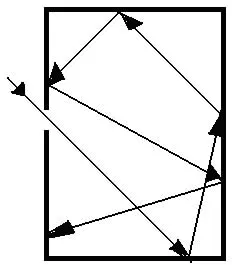
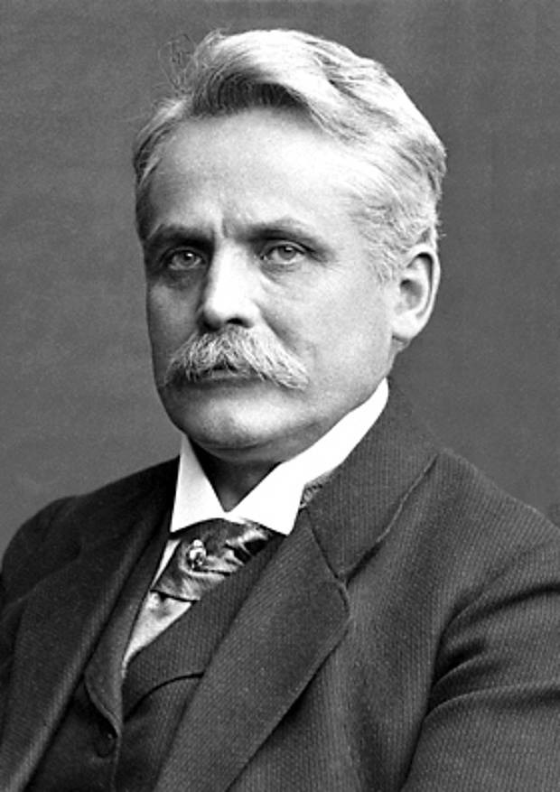
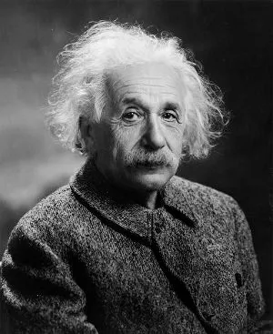
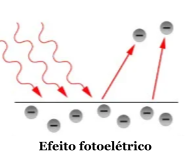
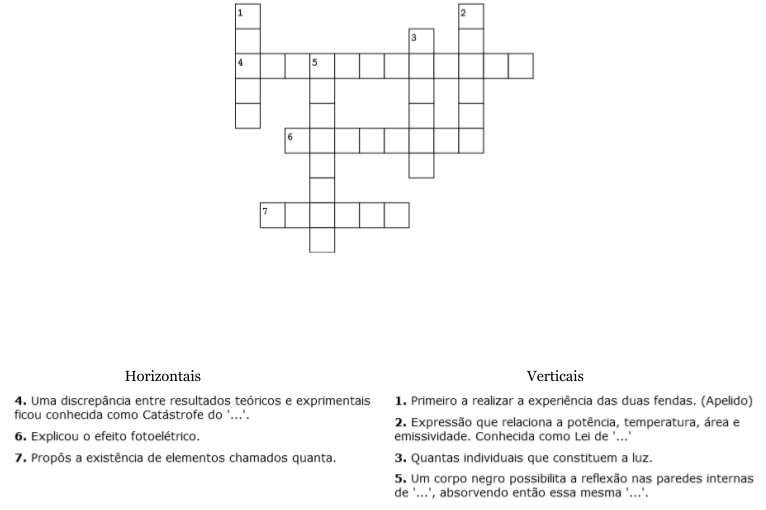

### História da física quântica  

  A física quântica é o ramo da física que estuda os sistemas físicos cujas dimensões são próximas ou abaixo da escala atómica, tais como moléculas, átomos, electrões e  protões, muito embora também possa ser usada para justificar fenómenos macroscópicos em diversos casos.
  Esta área da física é relativamente recente, e para a compreendermos melhor temos de estudar a sua história desde o início do século XIX, onde começaram a surgir teorias e experiências que evoluíram a nossa compreensão da luz. Por esta razão, vamos embarcar numa viagem no tempo, desde 1800 até ao presente!

#### 1805 - *** Experiência das duas fendas de Thomas Young ***
  Esta experiência consiste em deixar a luz visível difratar-se através de duas fendas. Na experiência foram usadas três ‘barreiras’. Na primeira havia apenas um pequeno orifício no qual ocorria a primeira difração proveniente de uma fonte monocromática. A segunda barreira tinha dois buracos colocados lado a lado para que a luz difratada no primeiro orifício atingisse esses dois buracos transformando-os em “fontes” coerentes, já que pertenciam à mesma fonte original de onda. Na última barreira eram projetadas manchas de interferência no qual podiam ser observados máximos (regiões bem iluminadas) e mínimos (regiões mal iluminadas) de intensidade. 

  Isto permitiu a Young entender melhor a difração e o fenómeno de interferência. Historicamente, este fenómeno serviu para demonstrar o caráter ondulatório da luz.

#### 1859 - *** Gustav Kirchhoff ***

  Em 1859, Gustav Kirchhoff formulou o problema da radiação do corpo negro. Para Kirchhoff, o corpo negro é um excelente emissor de radiação e toda a radiação que ele possui é emitida. Esta experiência tornou-se fundamental para o estudo das radiações térmicas devido à sua simplicidade: O modelo do corpo negro é caracterizado por uma abertura num objeto oco, o que possibilita a reflexão nas paredes internas de qualquer tipo de radiação emitida, absorvendo então essa mesma radiação.

#### 1879 - *** Jožef Stefan ***
  Em 1879, o físico esloveno Jožef Stefan deduziu que a potência P (energia irradiada por segundo) de um corpo negro é diretamente proporcional à sua temperatura T elevada à quarta potência, e também diretamente proporcional à área A da superfície emissora. Essa relação foi chamada de Lei de Stefan (também conhecida atualmente como Lei de Stefan-Boltzmann).

  P = e  x  σ  x  T4  x  A

  Onde σ = 5,67 x 10−8  Wm-2K-4 é a constante de Stefan-Boltzmann e ‘e’ é a emissividade, esta corresponde a um valor entre 0 e 1 que varia consoante o corpo seja um melhor ou pior absorsor e emissor de radiação.

#### 1892 - *** Wilhelm Wien ***

 Para um corpo negro, o valor do comprimento de onda para qual a intensidade da radiação é máxima, λ máx, é inversamente proporcional à temperatura absoluta, T.

  Esta relação é conhecida por Lei de Wien, em homenagem ao físico alemão Wilhelm Wien que a estabeleceu em 1892. A expressão que traduz esta lei é:

  Onde b é a constante de dispersão de Wien:  b = 2,898 x 10-3 m K 

#### 1900 - *** Max Planck - 'O Pai da Física Quântica' ***
 
 

 Finalmente em 1900, Max Planck formulou a hipótese que toda a energia é irradiada e absorvida na forma de elementos discretos chamados quanta. Segundo a teoria, cada um desses quanta tem energia proporcional à frequência ν da radiação eletromagnética emitida ou absorvida.

 Através das suas experiências, Planck deduziu o valor de h e deu-lhe o nome de ‘constante de Planck'. As suas descobertas foram reconhecidas mais tarde com o Prémio Nobel da Física de 1918.

h ➝ Constante de Planck (h = 6,63 x 10^{-34}J.s)

 *** Curiosidade: *** Segundo Max Planck, a teoria do comportamento ondulatório da luz proposta por Thomas Young no seguimento da experiência das duas fendas, é apenas um aspecto teórico dos processos de absorção e emissão de radiação e não tinha nada a ver com a realidade física da radiação em si.

#### 1911 - *** Catástrofe do ultravioleta ***
  No final do século XIX, a explicação do espectro de radiação térmica, com base na teoria eletromagnética de Maxwell, não estava de acordo com os resultados experimentais, em particular na zona da luz ultravioleta. Este problema ficou conhecido como a Catástrofe do Ultravioleta, sendo este termo usado pela primeira vez em 1911.

#### 1911 - *** Albert Einstein ***
 Até à data, não era possível explicar o efeito fotoelétrico, no qual a incidência de luz em certos materiais pode retirar eletrões do mesmo. Posto isto, em 1905, Albert Einstein explorou a ideia de que a própria luz é formada por quantas individuais, que em 1926 ficaram conhecidas como fotões. 

A energia de um fotão é dada pela expressão:
*** E = hf ***  
h - constante de Planck  
f - frequência da onda

#### 1924 - *** Louis De Broglie ***
 Louis De Broglie, físico francês, levou mais a fundo a ideia ondulatória da luz. Foi o primeiro a relacionar o comprimento de onda (λ) com o momento linear (p) da partícula e a Constante de Planck (h), em 1924, segundo a expressão:
λ = h p  
  *** Curiosidade: *** Em 1929, De Broglie recebeu o prémio Nobel da Física, e em  1938, a Medalha Max Planck.

#### 1954 - *** Max Born ***
 Max Born foi responsável pela solução de diversos problemas da física moderna. Born ganhou o Prémio Nobel da Física em 1954 pela sua investigação fundamental na Mecânica Quântica, especialmente na interpretação estatística da função ondulatória. As suas teorias sobre a constituição do átomo baseavam-se em axiomas fundamentais sobre a noção de dualidade entre os aspectos corpusculares e ondulatórios da matéria.
 Foi devido a este físico que ficámos a saber a caracterização definitiva dos conceitos de onda e corpúsculo, que são aspectos importantes no estabelecimento das bases do universo físico!

#### *** Quiz ***
Experimente resolver as palavras cruzadas para pôr em prática o que aprendeu! (ou clique [aqui](https://crosswordlabs.com/view/os-padrinhos-da-fisica-quantica-2))

*** Soluções ***

