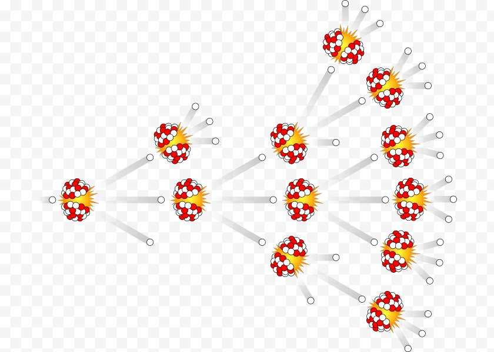
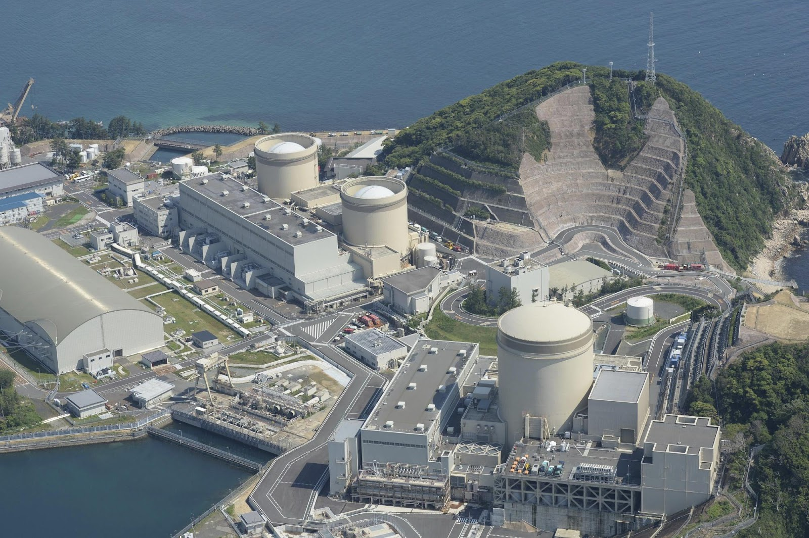
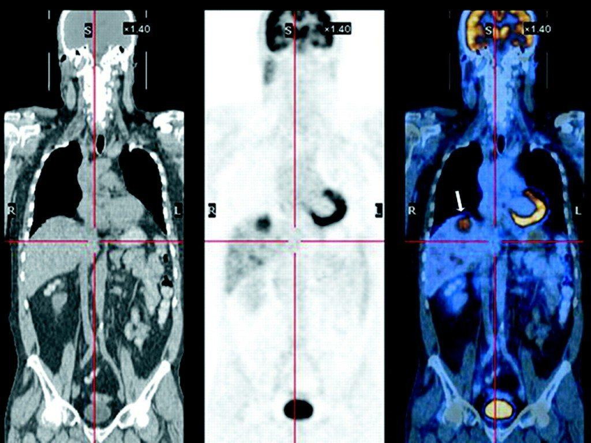
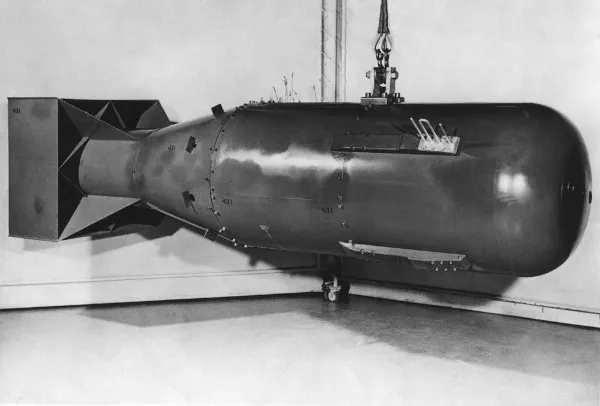
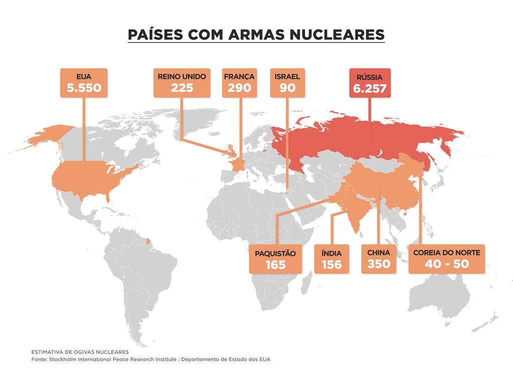
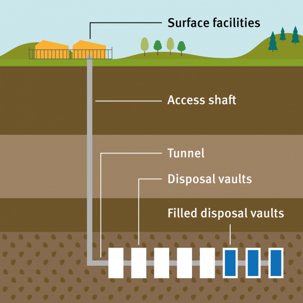
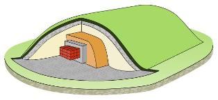

---                                                                                                                                         
client: "Tecnologia e Energia Nuclear"
title: "Tecnologia e Energia Nuclear"
cover: "./07094314252064.webp"
date: "2019-06-10"
service: ""
color: "#8e9d31"
---
Tecnologia nuclear é usada à nossa volta todos os dias, desde as suas utilizações medicinais a fornecer a nossa energia! São algo muito importante no nosso dia a dia e são invenções que revolucionaram as respetivas áreas. Mas quais são as utilizações mais importantes de energia nuclear na nossa vida?

## Energia Nuclear

Em 1934, o físico Enrico Fermi demonstrou que neutrões conseguem dividir átomos. De seguida, com a ajuda de Leo Szilard, o seu assistente, conclui que uma reação nuclear em cadeia é possível e em 1942 conseguem criar a primeira reação nuclear em cadeia. Em 1951, os Estados Unidos da América consegiu gerar eletricidade através de energia nuclear num reator experimental (EBR-1). Finalmente, em 1954, a União Soviética criou o primeiro reator nuclear comercial. Hoje em dia 10% da energia global é fornecida através de 440 reatores nucleares!

Estes reatores estão espalhados por todo o mundo, mas os Estados Unidos da América são o país com mais reatores nucleares operacionais (93).  Este método de obtenção de energia elétrica é uma excelente alternativa ao uso de combustíveis fósseis, pois é uma fonte de energia que não emite dióxido de carbono e é mais sustentável. Além disso, não ocupa muito espaço físico para energia que gera.

##### Mas como é que Funcionam?
Os reatores nucleares funcionam a partir de um processo chamado fissão nuclear. Tomando como exemplo o átomo Urânio-235, o átomo que é mais usado nas centrais nucleares, a reação tem como reagentes um átomo de Urânio-235 e um neutrão, que através de uma colisão entre os dois, o átomo é separado em dois átomos, Crípton-92 e Bário-141, e três neutrões. A reação é exotérmica e por isso liberta muita energia que aquece água à volta do reator. Esta água torna-se em vapor e o vapor roda uma turbina, gerando energia elétrica.

Esta reação é uma reação em cadeia. Três neutrões fazem parte dos produtos da reação, que apenas tem um neutrão como reagente. Os três neutrões são disparados do átomo de urânio a altas velocidades e colidem com outros átomos de urânio, criando uma nova reação e este processo continua como demonstrado na figura.

Também já tentaram criar estes reatores a partir de outro processo chamado fusão nuclear. Fusão nuclear é uma reação na qual dois ou mais átomos pequenos se juntam e formam um átomo maior, libertando muita energia na reação. É a reação que o sol usa para gerar a sua energia. Por enquanto, não é possível criar um reator com este tipo de reação porque requer muita energia para poder acontecer e a energia necessária para fazer a reação é muito maior do que a energia gerada, logo não faz sentido usar esta reação para geração de energia.

Os reatores de fissão nuclear têm de ser controlados e supervisionados com cuidado pois podem ser muito          5) Diagrama de uma fusão nuclear   destrutivos, como vimos no conhecido acidente da central nuclear de Chernobyl, em 1986. Esta reação necessita de ser regulada com um moderador. O moderador é um componente que faz parte dos reatores nucleares que serve para desacelerar os neutrões na reação de fissão nuclear. Os neutrões são libertados a altas velocidades (10% da velocidade da luz) e a estas velocidades, os neutrões têm uma menor possibilidade de colidir com um átomo e, portanto, reduz-se a velocidade para apenas 2 quilômetros por segundo. O moderador mais comum é a água, seguida por blocos de grafite. Mas como é que o moderador funciona?
Ao colocar um neutrão de alta velocidade num meio como a água, o neutrão fica sujeito a colisões. Quando o neutrão colide com um átomo, perde energia cinética e consequentemente perde velocidade.

O material escolhido para ser moderador deve ter uma baixa massa atómica e uma seção transversal de captura baixa, para não absorver os neutrões, apenas desacelerá-los. Contudo, a reação chegará a um ponto na qual é preciso absorver neutrões para controlar a reação e estes são absorvidos por um tubo ou placa que contém um material como boro, que reage com o neutrão, criando um isótopo estável.  

Adicionalmente, a reação cria produtos radioativos que têm de ser tratados cautelosamente para não espalharem a radiação. Um dos produtos radioativos são tubos com os restantes da reação, neste caso os dois átomos criados, que se estiverem a altas temperaturas, começam a derreter e libertam níveis de radiação extremamente altos. Consequentemente, a seguir a serem usados são postos ou em piscinas de água arrefecida durante muitos anos (à volta de 10 anos, apesar de permanecerem extremamente radioativos durante milhares de anos) ou são postos em moldes de cimento e estes são postos em túneis que são depois fechados para conter a radiação debaixo de terra.

## Utilizações das Tecnologias Nucleares na Medicina

Outra área muito importante onde é aplicada tecnologias nucleares é na medicina, em imagiologia nuclear como o PET-CT que é usado para detetar doenças cerebrais, doenças cardíacas e oncológicas.

O desenvolvimento desta tecnologia tem um grande impacto nas técnicas de rastreio em medicina. Com este equipamento, é possível obter imagens detalhadas dos órgãos e detetar numa fase precoce doenças do foro oncológico.

## Armamento Nuclear 

#### Tipos de Armamento Nuclear:

As armas nucleares são engenhos de destruição maciça que derivam de reações nucleares de fissão ou de reações de fissão e fusão combinadas. Como resultado, mesmo a menor e mais simples das armas nucleares será mais destrutiva e poderosa em relação às armas convencionais.  Estas foram utilizadas pela primeira vez na Segunda Guerra Mundial em 1945. Os dois tipos de armas nucleares que existem:
- Armas que produzem a sua energia através de reações nucleares de fissão, são conhecidas popularmente como *** bombas atómicas *** ou *** bombas de fissão ***;
- Armas nucleares, conhecidas como *** bombas de hidrogênio *** ou *** bombas de fusão ***, produzem uma incrível quantidade de energia por meio de reações de fusão nuclear;

Como podemos averiguar são armas de grande potência e para reforçar esta ideia detalharemos melhor cada uma destas armas:

- *** Armas por fissão nuclear ***:  a energia é produzida por meio de reações nucleares de fissão. Os produtos da fissão do urânio-235 nem sempre são os mesmos, podendo gerar diferentes isótopos ou até mesmo quantidades diferentes de neutrões (duas ou três mol). 
- *** Armas por fusão nuclear ***: Baseiam-se na chamada fusão nuclear, onde núcleos leves de hidrogénio e hélio combinam-se para formar elementos mais pesados que libertam neste processo enormes quantidades de energia. Bombas que utilizam a fusão nuclear são também chamadas bombas-H, bombas de hidrogênio ou bombas termonucleares, pois a fusão requer altíssimas temperaturas para que a sua reação em cadeia ocorra. A bomba de fusão nuclear é considerada a maior força destrutiva já criada pelo Homem, embora nunca tenha sido usada numa guerra.

## Distribuição Mundial de Armamento Nuclear
Agora que já percebemos a dimensão da potência das armas nucleares, iremos dar aos leitores uma perspetiva da distribuição deste armamento nuclear pelo mundo. Segundo levantamento da Federation of American Scientists - FAS, nove países possuíam cerca de 13100 armas nucleares,no início de 2021, sendo que aproximadamente 91% delas concentram-se na Rússia e nos Estados Unidos. Dessas 13100 armas, cerca de 9600 estão em bases militares para uso com mísseis, aeronaves, embarcações e submarinos. A Rússia e os Estados Unidos têm, juntos, 89,7% das armas nucleares do mundo. No total, os 2 países concentram 11527 ogivas nucleares, sendo 5977 do governo russo e 5550 do governo norte-americano, até fevereiro de 2022

## Armamento Nuclear em Portugal
A energia nuclear em Portugal foi muito limitada e estritamente não comercial. Portugal teve um reactor de investigação de 1 MW localizado no Centro Nacional de Investigação Nuclear, em Bobadela, perto de Sacavém, que se encontrava já há algum tempo em paragem permanente.
 
## Utilização das Tecnologias Nucleares na Exploração Espacial

A exploração espacial encontrou nas tecnologias nucleares, um meio que permite alcançar novos horizontes no transporte espacial. Uma das ideias mais promissoras é a tecnologia DFD que concretizada resultará num passo gigante para a exploração espacial.

#### Como Funciona?
A DFD (direct fusion drive), é um sistema baseado na fusão nuclear que usa o deutério como combustível. Essencialmente, o combustível em estado de plasma é injetado na esquerda do reator e a fusão ocorrerá no centro do reator, onde sob ação de um campo magnético intenso, se confina o movimento do plasma de deutério. O campo magnético impede as partículas de entrarem em contacto com as paredes do reator, o que dissiparia o calor produzido e consequentemente perderíamos propulsão.

Ao aquecer este combustível irá impulsionar o veículo espacial até muito mais longe do que as tecnologias usadas agora.

As principais vantagens desta tecnologia são a sua velocidade e a sua leveza. Atualmente, os veículos espaciais só conseguem chegar a velocidades entre os 20–50 km s-1 e pretende-se atingir 70 km s-1. Sendo assim será possível efetuar viagens em relativamente pouco tempo, ajudando assim também para a  saúde mental dos tripulantes que não teriam de ficar confinados durante tanto tempo. Os combustíveis usados atualmente emitem um nível perigoso de radiação, felizmente esta tecnologia também irá fornecer uma solução para este problema. O último tópico a favor desta ideia é o facto de ela ser bastante leve, deixando lugar para mais equipamentos de estudo extraterrestre.

#### Métodos de Disposição de Resíduos Radioativos

Devido aos seus benefícios, a energia nuclear é utilizada de forma generalizada, assim existem também muitos resíduos radioativos, provenientes dos reatores nucleares. O problema que eles tentam resolver é como se livram destes produtos perigosos.

Essencialmente existem duas categorias de formas de se gerir este problema:

Disposição de resíduos perto da superfície:
- Estas instalações encontram-se à superfície ou abaixo da superfície onde a cobertura de proteção tem poucos metros de espessura. Os contentores de resíduos são colocados em cofres e eventualmente, serão cobertos e tapados com uma membrana impermeável e também com solo da superfície. Estas instalações podem incorporar alguma forma de drenagem e possivelmente um sistema de ventilação de gás.
- Dentro desta categoria também é possível se construírem instalações de eliminação próximas da superfície, no entanto, em cavernas abaixo do nível do solo. Ao contrário da eliminação próxima da superfície, ao nível do solo, onde as escavações são realizadas a partir da superfície, a eliminação pouco profunda requer a escavação subterrânea de cavernas. A instalação encontra-se a uma profundidade de várias dezenas de metros abaixo da superfície da Terra.
- Estas instalações serão afetadas por alterações climáticas a longo prazo. Sendo assim deve-se ter em conta a segurança da área, visto que tais alterações podem perturbar estas instalações. Esta categoria de instalações é, portanto, tipicamente utilizado para resíduos pouco radioativos e resíduos com uma radioatividade intermédia, mas com uma meia vida de até 30 anos.

Disposição geológica profunda:
- Os longos períodos durante os quais alguns resíduos permanecem radioativos levaram à ideia da eliminação profunda em depósitos subterrâneos em formações geológicas estáveis. O isolamento é feito por uma combinação de barreiras artificiais e naturais (rocha, sal, argila). Não existe nenhuma obrigação de manter a instalação tripulada ajudando assim para a saúde dos trabalhadores. O depósito fornece barreiras para evitar que a radiação chegue aos seres humanos e ao ambiente ao redor. Além disso, as águas subterrâneas profundas são geralmente desprovidas de oxigénio, minimizando a possibilidade de mobilização química dos resíduos.

Atualmente existem várias ideias para novas formas de disposição de materiais radioativos, estas ideias ou já são implementadas em alguns países, ou foram abandonadas devido a riscos para a saúde ou o custo é demasiado elevado. Alguns destes são:
- Armazenamento a longo prazo acima do solo
- Eliminação de resíduos para o espaço
- Derretimento de rochas
- Eliminação nas zonas de subducção
- Disposição no mar
- Disposição no subsolo marinho
- Disposição nas placas de gelo
- Injeção de materiais líquidos em rochas profundas 

Para além das áreas com maior utilização de tecnologia nuclear mencionadas acima, esta também é utilizada em muitas outras indústrias. Algumas dessas utilizações são: identificar propriedades de diferentes materiais, produção de hidrogénio, medir níveis de poluição e mudar propriedades de materiais para produzir materiais diferentes.

## Suma
Em suma, a tecnologia nuclear tem um campo variado de aplicações que consideramos extremamente benéficas para a nossa civilização. Apesar de haver alguns riscos associados com a utilização de tecnologia nuclear como possível exposição à radiação, hoje em dia há muitas medidas de segurança postas nos equipamentos nucleares que tornam a sua utilização segura e de confiança. Adicionalmente, a tecnologia nuclear ainda é relativamente recente e, portanto, haverá muitas mais inovações no futuro próximo que possivelmente darão ao seu uso em outras áreas!

